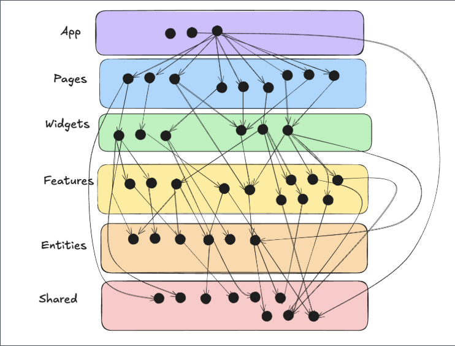
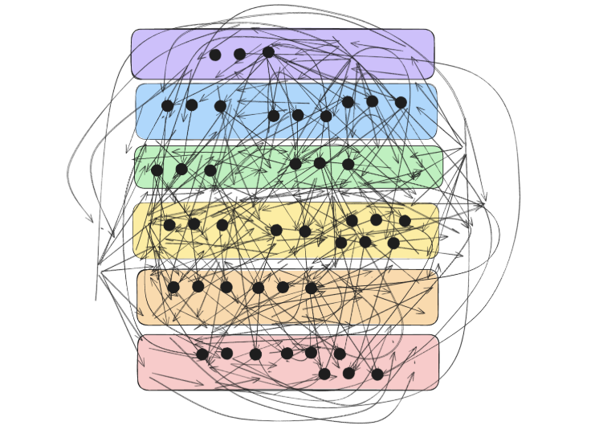
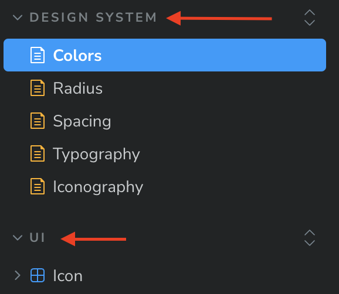
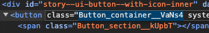
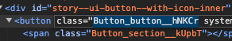

# frontend-regulations
Этот репозиторий содержит регламенты по frontend-разработке: правила код-стайла, архитектурные принципы (Feature-Sliced Design), оформление git-процессов, стандарты тестирования, стилизации и обработки ошибок.

# Оглавление регламента Frontend-разработки

## 1. Командная работа и взаимодействие

- Внутрикомандное взаимодействие
- Использование нейросетей

## 2. Общие положения

- Предисловие
- Цель регламента

## 3. Стиль кодирования и именование

- Ясность и самодокументированность
- Следуйте соглашениям
- Используйте категории или контексты
- Не завязывайтесь на конкретных значениях
- Уточняйте единицы измерения
- Избегайте "магических чисел"
- Naming Convention (Именование)
- Early return

## 4. Структура проекта и архитектура

- Основные принципы (Feature-Sliced Design)
- Понятия (слои, слайсы, сегменты)
- Структура проекта
- Слои и их ответственность
- Основные правила
- Как определить, к какому слою относится модуль?
- Принципы организации кода
- Примеры организации фич и сущностей

## 5. Импорты, экспорты и организация файлов

- Import/Export
  - Избегайте дублирования путей
- Использование перечислений (`enum` запрещён)

## 6. Комментарии, документация и тесты

- Комментарии и документация (на английском языке)
- Тестирование
  - Именование автотестов
- Storybook
  - Зачем?
  - Принцип
  - Папки
  - Директории файлов документации

## 7. Стилизация

- Стилизация (CSS-модули, `styles`, нейминг классов)
- Глобальные CSS переменные (цвета, радиусы, spacing, типографика)
- Иконки

## 8. Git-процессы

- Основные ветки (`master`, `develop`)
- Naming (ветки, коммиты, MR, релизы → английский язык)
- Ветвление
  - Feature branches
  - Bugfix branches
  - Release branches
  - Hotfix branches
- Работа с Label
- Работа с Release for Team/Tech Lead
- Работа с Draft

## 9. Работа с ошибками и асинхронностью

- Обработка ошибок
  - Общие принципы
  - Frontend (✅ Хорошо / ❌ Плохо)
  - Обработка HTTP-ошибок
  - Error Boundaries
- Асинхронность и Side Effects
  - Принципы
  - Структура useEffect
  - Async-хуки
  - Отмена запросов

# 1. Командная работа и взаимодействие

## Внутрикомандное взаимодействие

- Все рабочие вопросы обсуждаются в общем командном чате или в специализированных каналах (например, #frontend, #design, #auth), чтобы обеспечить прозрачность и вовлечённость всех участников.
- Обсуждение рабочих вопросов только в Rocket.Chat.
- Перед созданием тикета или начала работы над задачей — уточнять контекст у тимлида или ответственного за блок. Это исключает дублирование и снижает риск неверной реализации.
- Прикладывать скриншоты, ссылки на PR, ветки, сниппеты или макеты к сообщениям. Не заставляй других искать контекст.
- Вопросы, не требующие обсуждения — в личные сообщения. Вопросы, потенциально важные для других — только в общий чат.
- В коде и pull/merge request'ах не бояться задавать вопросы. Лучше задать "глупый" вопрос, чем потратить 3 часа на неверное решение.
- Если договорённость изменяется — сразу сообщать об этом команде.
- Code review и обсуждения задач проводятся уважительно. Критикуем код, а не человека.
- Любое недопонимание — проговаривается. Не замалчивается. Коммуникация важнее догадок.

> Короче, читы — бан, кемперство — бан, оскорбления — бан, оскорбление администрации — расстрел, потом бан. Всё, удачи!

---

## Использование нейросетей

- Использование нейросетей (например, ChatGPT, Copilot и аналогов) допускается только для решения локальных и чётко сформулированных подзадач — например, генерации регулярного выражения, составления типизации, примера запроса и т.п.
- Перед использованием генеративного кода — обязательно проверять результат вручную и осознавать, как он работает. Слепое копирование без понимания не допускается.
- В случае сомнений — обращаться к тимлиду или обсуждать задачу с командой.

---

# 2. Общие положения

## Предисловие

В этом разделе базы знаний вы найдете необходимые регламенты по frontend-разработке.  
Если у вас возникнут вопросы, обращайтесь к своему лиду или автору статьи.

Если вы заметите несоответствие между регламентом и кодом проекта, комментариями во время ревью или словами одного из разработчиков, обязательно сошлитесь на статью. Возможно, какая-то из статей устарела и её необходимо обновить, или кто-то из разработчиков использует устаревшую или неверную информацию.

---

## Цель регламента

Цель данного регламента — установить ясные и однозначные правила для наименования элементов кода, чтобы улучшить читаемость, поддержку и совместную работу в проекте.  
Он направлен на создание осмысленных, самодокументированных и структурированных названий, которые способствуют избеганию путаницы и облегчению понимания кода.

---

# 3. Стиль кодирования и именование

## Ясность и самодокументированность

- Названия должны быть осмысленными. Имя константы, компонента, метода, типа и т.д. должно чётко указывать, что именно оно представляет. Например, вместо `MAX` лучше использовать `MAX_CONNECTIONS`.
- Не используйте аббревиатуры без необходимости. Например, `DATA_BASE_TIMEOUT` предпочтительнее, чем `DB_TIMEOUT`, а уж тем более чем `DBTO`.

---

## Следуйте соглашениям

- **UPPER_SNAKE_CASE для констант.** UPPER_SNAKE_CASE представляет собой стиль написания составных слов или фраз, в котором все слова пишутся в верхнем регистре и разделяются нижними подчеркиваниями `*`.
  Примеры: `DEFAULT_TIMEOUT`, `PI`.

  Так же это правило распространяется на ключи в объектных-константах.
  Примеры:

  ```typescript
  export type ValueOf<T> = T[keyof T];
  ```

  ```typescript
  export const Language = {
    EN: 'en',
    RU: 'ru',
  } as const;
  export type Language = ValueOf<typeof Language>;
  ```

  ```typescript
  export const SortDirection = {
    ASC: 'ASC',
    DESC: 'DESC',
  } as const;
  export type SortDirection = ValueOf<typeof SortDirection>;
  ```

  ```typescript
  export const AppRoute = {
    CHANNELS: '/channels',
    SERVICE_CATALOG: '/service/catalog',
    SERVICE_CATALOG_INFO: '/service/catalog/[uid]/info',
    SERVICE_CATALOG_STATISTICS: '/service/catalog/[uid]/statistics',
    // ...
  } as const;
  export type AppRoute = ValueOf<typeof AppRoute>;
  ```

- **PascalCase для компонентов и типизации.** PascalCase представляет собой стиль написания составных слов или фраз, в котором каждое слово начинается с заглавной буквы, без пробелов и разделителей.
  Примеры: `SearchQueryInput`, `TUser`, `ComponentProps`.
- **Префиксы/Постфиксы для типизации.** Для типов префикс `T`, для интерфейсов префикс `I` (исключениями являются интерфейсы описывающие пропсы компонентов, для них используется постфикс `Props`).
  Примеры: `TLanguage`, `ILanguage`, `ButtonProps`.
- **camelCase для функций, методов, переменных, хуков и стилей.** camelCase представляет собой стиль написания составных слов или фраз, в котором первое слово начинается с маленькой буквы, а последующие — с заглавной, без пробелов и разделителей.
  Примеры: `getLanguagesList`, `useSortableTable`, `handleCheckboxChange`, `selectedItems`, `loaderContainer`.
- **kebab-case для стилей зависимых от входных параметров компонента.** kebab-case представляет собой стиль написания составных слов или фраз, в котором все слова пишутся с маленькой буквы и разделяются дефисами. Пример:

  ```css
  .variant-primary {
     ...
  }
  .variant-secondary {
     ...
  }
  .size-100 {
     ...
  }

  .size-200 {
     ...
  }

  ```

  Такой подход позволяет повысить читаемость применяемых стилей внутри компонента

  ```typescript
  const variantStyle = styles[`variant-${variant}`];
  const sizeStyle = styles[`size-${size}`];
  ```

---

## Используйте категории или контексты

Названия, относящиеся к конкретному контексту, желательно делать частью этого контекста:

- вместо `LINK_MAX_LENGTH` лучше `CHANNEL_LINK_MAX_LENGTH`
- вместо `SortFilter` лучше `ProjectsSortFilter`
- вместо `useData` лучше `useApplicationsData`
- вместо `TGetListResponse` лучше `TGetThemesListResponse`.

Это помогает избежать конфликта имён и даёт понимание, как связаны значения констант.

---

## Не завязывайтесь на конкретных значениях

Константа должна отражать смысл, а не текущее значение.

- вместо `SECONDS_60 = 60` лучше `DEFAULT_SESSION_TIMEOUT = 60`
- вместо `--system-color-red-400: #e85555` лучше `--system-color-danger-400: #e85555`
- вместо `--system-radius-24: 24px` лучше `--system-radius-large: 24px`.

Значение может измениться, но смысл останется прежним.

---

## Уточняйте единицы измерения

Если константа связана с числовым значением, всегда уточняйте единицы:

- вместо `MAX_FILE_SIZE = 100` лучше `MAX_FILE_SIZE_MB = 100`
- вместо `ERROR_DISPLAY_TIME = 5000` лучше `ERROR_DISPLAY_TIME_MS = 5000`.

---

## Избегайте «магических чисел»

Если число или строка имеет смысл только в конкретном контексте — используйте для них константы.
Плохо:

```js
if (retries > 3) { ... }
```

Хорошо:

```js
const MAX_RETRIES = 3;
if (retries > MAX_RETRIES) { ... }
```

---

## Early return (ранний выход)

Используйте ранний выход, чтобы уменьшать вложенность и повышать читаемость кода.
Плохо:

```js
if (value > 1) {
  onChange(value - 1);
}
```

Хорошо:

```js
if (!(value > 1)) return;
onChange(value - 1);
```

Таким образом мы уменьшаем вложенность и повышаем читаемость кода.

---

# 4. Структура проекта и архитектура

Цель данного регламента — установить структуру и принципы для организации фронтенд-кода с помощью методологии Feature Sliced Design (FSD), обеспечивая разделение функционала на независимые модули, инкапсуляцию логики и данных, и правильное управление зависимостями между модулями. Регламент направлен на создание чистой и гибкой архитектуры проекта, упрощение его поддержки и расширения.

## Основные принципы

Feature Sliced Design (FSD) представляет собой методологию, направленную на организацию фронтенд-кода путем разделения функционала на независимые модули.

Подробнее можно ознакомиться в документации, поддерживает русский язык, что приятно. <https://feature-sliced.design/ru/>

Основные принципы FSD включают:

- **Функциональное разделение**: модули и компоненты должны быть разделены на слои (entities, features, shared, pages и т.д.) в зависимости от их роли и ответственности.
- **Инкапсуляция**: каждый модуль должен содержать только ту логику и данные, которые относятся к его области ответственности.
- **Иерархия зависимостей**: модули верхнего уровня могут зависеть от модулей нижнего уровня, но не наоборот.

---

## Понятия

**Слои** – это директории верхнего уровня, такие как `app`, `pages`, `widgets`, `features`, `entities`, `shared`.

**Слайсы** – это директории, представляющие предметную область, которые располагаются внутри слоев (за исключением `app` и `shared`). Каждый слайс описывает конкретный процесс или сущность. Примеры: `manager`, `user-authorization-form`, `product-list`.

**Сегменты** – это директории, организующие код по его назначению. Они находятся внутри слайсов, а также в слоях `app` и `shared`. Примеры сегментов: `ui`, `api`, `lib`, `model`, `config`. Нейминг сегментов не является строгим и может быть адаптирован под нужды вашего проекта.

Подробнее можно ознакомиться в документации в разделе "Обзор". <https://feature-sliced.design/ru/docs/get-started/overview>

---

## Структура проекта

Проект должен быть организован по слоям, каждый из которых отвечает за конкретную задачу

```
src/
├── app/                // Роутинг, компоненты страниц, инициализация приложения, глобальные стили и провайдеры
├── shared/             // Переиспользуемые ресурсы (UI-компоненты, утилиты, библиотеки)
│   ├── api/            // Обертки для работы с API
│   ├── config/         // Конфигурации приложения
│   ├── constants/      // Константы
│   ├── lib/            // Утилиты и вспомогательные функции
│   └── ui/             // Переиспользуемые UI-компоненты
├── entities/           // Бизнес-сущности (например, User, Product)
│   ├── user/
│   └── product/
├── features/           // Фичи (функциональные модули)
│   ├── authentication/
│   └── shopping-cart/
└── widgets/            // Виджеты (композиции фич и сущностей)
    ├── header/
    └── footer/
```

<span style="color:darkred;">ВАЖНО!!</span> Мы используем методологию проектирования Feature Sliced Design (FSD), согласно которой компоненты страниц должны размещаться в соответствующем слое `/page`. Однако в Next.js папка `/page` зарезервирована для построения роутинга. Несмотря на то что мы применяем рекомендованный в Next.js с версии 13 app роутинг, фреймворк по-прежнему не позволяет нам использовать папку `/page` и выдаёт ошибку о конфликте. Поэтому в данном случае мы отклоняемся от методологии FSD и инициализируем компоненты страниц непосредственно в их директориях роутинга.

<span style="color:darkred;">ВАЖНО!!</span> В проектах где используется Tanstack-router нужно использовать папку pages для страниц.

---

## Слои и их ответственность

1. **App** `src/app/`:
   - Роутинг
   - Инициализация приложения.
   - Глобальные стили и провайдеры.
   - Конфигурация роутера Next.js.
2. **Pages** `src/pages/`:
   - Страницы приложения.
   - Логика маршрутизации и рендеринга страниц.
3. **Widgets** `src/widgets/`:
   - Композиционные блоки, объединяющие фичи и сущности.
   - Виджеты могут включать в себя сложные UI-компоненты, собирающие несколько фич и сущностей.
4. **Features** `src/features/`:
   - Реализация функциональных модулей приложения.
   - Каждая фича изолирована и может включать в себя UI-компоненты, бизнес-логику, API-вызовы и состояния.
5. **Entities** `src/entities/`:
   - Определение бизнес-сущностей.
   - Сущности содержат модели, логику и компоненты, относящиеся к конкретным сущностям.
6. **Shared** `src/shared/`:
   - `api/`: Обертки и модули для работы с API.
   - `config/`: Конфигурационные файлы и настройки.
   - `constants/`: Константы, используемые в приложении.
   - `lib/`: Утилиты и вспомогательные функции.
   - `ui/`: Переиспользуемые UI-компоненты.

---

## Основные правила

### Сохраняйте однонаправленность

Модули на одном слое могут использовать только модули находящиеся на слоях строго ниже.

В таблице ниже приведен список доступностей

| Слой       | Он может использовать                            | Его могут использовать                        |
| ---------- | ------------------------------------------------ | --------------------------------------------- |
| `app`      | `pages` `widgets` `features` `entities` `shared` | \-                                            |
| `pages`    | `widgets` `features` `entities` `shared`         | `app`                                         |
| `widgets`  | `features` `entities` `shared`                   | `app` `pages`                                 |
| `features` | `entities` `shared`                              | `app` `pages` `widgets`                       |
| `entities` | `shared`                                         | `app` `pages` `widgets` `features`            |
| `shared`   | \-                                               | `app` `pages` `widgets` `features` `entities` |

### Избегайте сцепленности между слайсам на одном уровне

Слайсы на одном слое не могут использовать друг друга, то есть widget не может использовать widget, фича не может использовать фичу. Обратите внимание что это правило не касается слоев app и shared, т.к. внутри них не используются слайсы.

### Используйте Public API правильно

### Хороший публичный API делает использование и интеграцию слайса в другой код удобным и надежным. Этого можно достичь, поставив три цели

1. Остальная часть приложения должна быть защищена от структурных изменений в слайсе, таких как рефакторинг.
2. Значительные изменения в поведении слайса, которые нарушают предыдущие ожидания, должны вызывать изменения в публичном API.
3. Только необходимые части слайса должны быть доступны.

Последняя цель имеет важные практические последствия. Может возникнуть соблазн создать слепые реэкспорты всего, особенно на ранних этапах разработки слайса, потому что любые новые объекты, которые вы экспортируете из своих файлов, также автоматически экспортируются из слайса:

❌ Плохо:

**features/comments/index.js**

```ts
export * from './ui/Comment'; // 👎 не пытайтесь повторить дома
export * from './model/comments'; // 💩 это плохая практика
```

Это ухудшает понимаемость слайса беглым взглядом, потому что вы не можете легко определить, каков интерфейс этого слайса. Не зная интерфейс, вам придется глубоко погружаться в код слайса, чтобы понять, как его интегрировать. Еще одна проблема заключается в том, что вы можете случайно раскрыть внутренние модули, что усложнит рефакторинг, если кто-то начнет от них зависеть.

Подробнее можно ознакомиться в документации в разделе "Public API". <https://feature-sliced.design/ru/docs/reference/public-api>

### Итог

Эти правила составляют основной костяк методологии Feature Sliced Design и позволяют нам создавать простую и понятную структуру проекта. Риски ошибок при изменениях сильно снижаются и проект проще масштабировать.

✅ Хорошо:



❌ Плохо:



---

## Как определить, к какому слою относится модуль?

В первую очередь важно понять, что Feature-Sliced Design — это методология, которая строится на бизнес ценностях программного продукта. Поэтому и смотреть на слайсы вы должны с точки зрения бизнеса в первую очередь, а не ограничиваться только технической точкой зрения инженера.

---

## Принципы организации кода

- DRY (Don't Repeat Yourself): Избегайте дублирования кода, выносите повторяющиеся части в shared слой.

- SOLID: Принципы объектно-ориентированного проектирования должны применяться для улучшения структуры и гибкости кода.

- Чистая архитектура: Код должен быть написан так, чтобы его было легко читать и поддерживать.

---

## Naming Convention (правила именования)

- `kebab-case`:
  - Папки (исключение папки React-компонентов компонентов)
  - app роутинг Next.js
- `camelCase`:
  - Файлы функции/методов
  - Файлы кастомных хуков
  - Файлы HOC-ов
- `PascalCase`:
  - Файлы React-компонентов
  - Папки React-компонентов
  - Файлы Storybook документации

---

## Примеры организации

**Feature: Authentication**

```
src/features/authentication/
├── model/
│   ├── useAuth.ts      // Логика аутентификации (хуки, сторы)
│   └── types.ts        // Типы данных
├── ui/
│   ├── LoginForm.tsx   // Компонент формы логина
│   └── SignupForm.tsx  // Компонент формы регистрации
├── api/
│   └── authApi.ts      // API вызовы для аутентификации
└── index.ts            // Экспорт всего необходимого для использования фичи
```

**Entity: User**

```
src/entities/user/
├── model/
│   ├── userModel.ts    // Модель пользователя
│   └── userTypes.ts    // Типы данных пользователя
├── ui/
│   ├── UserProfile.tsx // Компонент профиля пользователя
│   └── UserCard.tsx    // Компонент карточки пользователя
└── index.ts            // Экспорт всего необходимого для использования сущности
```

---

# 5. Импорты, экспорты и организация файлов

## Import/Export

- Старайтесь избегать дублирования в путях при импортах и экспортах.
  Плохо:

  ```ts
  import { Pagination } from '../Pagination/Pagination';
  ```

  Хорошо:

  ```ts
  import { Pagination } from '../Pagination';
  ```

- Для этого используйте `index.ts` файлы для промежуточных экспортов.
  Пример:

  ```ts
  export { Pagination } from './Pagination';
  ```

Используем `@/ алиас` + ESLint правило запрета deep-import’ов внутри чужих слайсов (только через публичный index.ts).

---

## Использование перечислений

- Использование `enum` в проекте запрещено.
- Вместо `enum` нужно использовать константные объектные литералы с `as const` и типами через утилиту `ValueOf`. Это обеспечивает:
  - предсказуемое поведение на уровне JavaScript (в отличие от `enum`),
  - совместимость с сериализацией (например, при передаче значений в API),
  - лучшую интеграцию с `Object.values`, `Object.keys` и маппингами.

Пример правильного подхода:

```ts
export const Language = {
  EN: 'en',
  RU: 'ru',
} as const;

export type Language = ValueOf<typeof Language>;
```

Общая утилита для вывода значений:

```ts
export type ValueOf<T> = T[keyof T];
export type TValueOfArray<T extends readonly unknown[]> = T[number];
```

**Это правило распространяется на все случаи: маршруты, направления сортировки, языки, роли и т.п**

# 6. Комментарии, документация и тесты

## Комментарии и документация

- Все комментарии и документация внутри кодовой базы пишутся строго на английском языке.
  Имена переменных, файлов, коммитов, MR — тоже на английском

## Тестирование

- Автотесты необходимо именовать по следующему паттерну:
  `'<Функционал>. <Описание тестируемого кейса>'`

Пример:

```ts
test('Icon UI. Render with invalid name', () => {
  const { container } = render(<Icon name={'InvalidName' as keyof typeof Icons} />);
  expect(container.firstChild).toBeNull();
});
```

---

## Storybook

_Зачем нужен Storybook?_

В первую очередь, Storybook используется в проекте для обеспечения прозрачности составных компонентов пользовательской части проекта (frontend) как для разработчиков, так и для сторонних наблюдателей. Это позволяет разработчикам лучше понимать, из каких элементов можно собрать ту или иную функциональность проекта и из чего состоят уже существующие, а сторонним наблюдателям наглядно видеть процесс разработки и поддержки этих компонентов.

- Он обеспечивает прозрачность составных компонентов для разработчиков и сторонних наблюдателей.
- Разработчики могут видеть, из каких элементов собирается функциональность.
- Сторонние наблюдатели получают визуальное понимание текущего состояния UI.

_Принцип_

- Все составные части проекта, которые влияют на функциональность и внешний вид (CSS переменные, UI-компоненты и т.п.), должны быть задокументированы в Storybook.

_Папки_

- Для документации используйте отдельные разделы, такие как **Design System** и **UI**, не оставляйте компоненты документации без структуры.



_Директории файлов документации_

Располагайте `stories.tsx` и `MDX` файлы рядом с документируемым модулем.

Если это файл с CSS переменными `colors.css` то прямо рядом с ним `MDX` файл с именованием через PascalCase `Colors.mdx`:

```
.../
├── colors.css
└── Colors.mdx
```

Если это файл с tsx компонент, то создайте внутри его директории папку docs и занесите туда необходимые `stories.tsx` или `MDX` файлы:

```
.../
├── docs/
│   ├── Icon.stories.tsx
│   └── Iconography.mdx
└── Icon.tsx
```

---

# 7. Стилизация

Цель данного регламента — установить стандарты для использования CSS переменных и классов, чтобы обеспечить единообразие, гибкость и централизованное управление стилями в проекте. Регламент предлагает четкие правила именования и градации для цветов, типографики, закруглений и отступов, что упрощает их изменение и рефакторинг, поддерживает согласованность дизайна и экономит ресурсы при обновлениях.

## CSS-модули

- При импорте CSS-модулей всегда называйте их `styles`.
  Пример:

  ```ts
  import styles from './Button.module.css';
  ```

- Избегайте дублирования в названиях классов. CSS-модули автоматически подставляют префикс с названием компонента, поэтому нет необходимости повторять его внутри файла.
  Плохо:

  ```css
  /* Button.module.css */
  .button {
    ...
  }
  ```

  Хорошо:

  ```css
  /* Button.module.css */
  .container {
    ...
  }
  ```

**Результат**

✅ Хорошо:



❌ Плохо:



---

## Глобальные CSS-переменные

- Для отступов, цветов, типографики и закруглений используйте глобальные CSS-переменные.
- Переменные должны быть названы по смыслу, а не по конкретному значению.
  - вместо `--system-color-red-400: #e85555` лучше `--system-color-danger-400: #e85555`
  - вместо `--system-radius-24: 24px` лучше `--system-radius-large: 24px`

Это обеспечивает единообразие стилей и упрощает рефакторинг.

При использовании в проекте css-фреймворков, например `tailwindcss` используйте встроенные классы.

---

## Иконки

- Для проекта N существовал отдельный компонент `Icon` для отрисовки иконок, но этот подход может быть либо распространён на все проекты, либо исключён.
- Использование конкретного правила по иконкам требует уточнения для каждого проекта.

---

# 8. Git-процессы

Этот регламент позволяет упорядочить процесс разработки и выпуска программного обеспечения в среде Git и GitLab, обеспечивая стабильность и прозрачность всех этапов работы.

## Основные ветки

- `master` — основная ветка, всегда содержит стабильный код, готовый для продакшена.
- `develop` — ветка для интеграции всех фич и изменений, которые проходят тестирование перед релизом. В ней может быть нестабильный код, но он должен быть рабочим.

---

## Правила именования

- Ветки, коммиты, релизы и Merge Request пишутся строго на английском языке.
  Имена переменных, файлов, коммитов, MR — тоже на английском

---

## Ветвление

_Feature branches_

Используются для разработки новых фич или для внесения глобальных изменений в логику.

- Название: `feature/номер-задачи/название-фичи`
- Создание: от `develop`
- Слияние: в `develop`
- Формат коммита: `[номер-задачи] Feature. <блок>. <описание>.`
- Пример: `feature/TM-123/order-templates`

_Bugfix branches_

Используются для исправления багов в develop или release ветке. Если создается от develop, то мержатся в develop. Если создается от release, то мержатся в release (и в develop, если это необходимо).

- Название: `bugfix/номер-задачи/название-исправления`
- Создание: от `develop` или `release`
- Слияние: обратно в ту же ветку (`develop` или `release`)
- Формат коммита: `[номер-задачи] Bugfix. <блок>. <описание>.`

_Release branches_

Создаются для подготовки нового релиза. В этой ветке проводится финальное тестирование и исправление багов перед мержем в master.

- Название: `release/номер-релиза`
- Создание: от `develop`
- Слияние: в `master` и `develop`

_Hotfix branches_

Используются для срочного исправления багов в продакшене. Создаются от master и мержатся обратно в master и develop (и в релизную ветку, если она существует).

- Название: `hotfix/номер-задачи(опционально)/название-исправления`
- Создание: от `master`
- Слияние: в `master` и `develop`
- Формат коммита: `[номер-задачи(опционально)] Hotfix. <блок>. <описание>.`

---

## Работа с Label

- Метки (`labels`) используются для категоризации Merge Request.
- Основные типы:
  - тип задачи: `feature`, `bugfix`, `hotfix`, `release`
  - приоритет: `high`, `medium`, `low`
  - ответственный: `alex`, `oliver`, `john`

При создании Merge Request-а обязательно заполните поле Labels и укажите там тип вашей задачи, её приоритет и исполнителя.

---

## Работа с Release

Release (релизы) создаются на основе веток `release` и представляют собой официальные выпуски продукта. Каждая версия релиза должна содержать:

- Версия: Номер версии релиза
- Описание: Описание изменений, включенных в релиз
- Дата выпуска: Дата, когда релиз был создан
- Связанные задачи и ветки: Список задач и веток, включенных в релиз

---

## Работа с Draft

- Если Merge Request готов к code review — его нужно выводить из статуса draft.
- Если работа ещё не завершена — переводить в draft.

---

# 9. Работа с ошибками и асинхронностью

## Общие принципы обработки ошибок

- Не допускайте «тихих» ошибок — всегда логируйте или обрабатывайте их.
- Ошибки должны быть понятны и пользователю, и разработчику: показывайте user-friendly сообщения и сохраняйте технические логи.
- Централизуйте обработку ошибок, избегайте дублирования в разных местах.

---

## Frontend

Хорошо:

```ts
try {
  await login(credentials);
  await navigate('/dashboard');
} catch (error) {
  showToast('Login failed. Please check your credentials.');
  sentry(error);
}
```

Плохо:

```ts
await login(credentials); // ошибка проигнорирована
```

---

## Обработка HTTP-ошибок

- Используйте обёртку для API-клиента (например, axios instance), которая:
  - перехватывает ошибки через интерсепторы,
  - пробрасывает `HttpError` с кодом и сообщением,
  - автоматически обрабатывает 401/403 (например, редирект на login).

Пример:

```ts
axios.interceptors.response.use(
  (response) => response,
  (error) => {
    const { status } = error.response;

    if (status === 401) redirectToLogin();
    if (status >= 500) logToSentry(error);

    return Promise.reject(new HttpError(status, error.message));
  },
);
```

---

## Error Boundaries

- Используйте `ErrorBoundary`, чтобы защитить UI от падения при неожиданных исключениях в рендере.

Пример:

```tsx
<ErrorBoundary fallback={<FallbackUI />}>
  <MainPage />
</ErrorBoundary>
```

---

## Асинхронность и Side Effects

### Принципы

- Все сайд-эффекты (запросы, подписки, таймеры) должны размещаться в `useEffect`, `useLayoutEffect` или кастомных хуках.
- Минимизируйте количество эффектов в одном компоненте.
- Не используйте `useEffect` как инициализатор сложной логики — выносите её в отдельные хуки или модули.

---

## Структура useEffect

Хорошо:

```ts
useEffect(() => {
  let isMounted = true;

  fetchData().then((data) => {
    if (isMounted) {
      setData(data);
    }
  });

  return () => {
    isMounted = false;
  };
}, []);
```

или

```ts
useEffect(() => {
  const controller = new AbortController();

  fetch('/api/data', { signal: controller.signal })
    .then((res) => res.json())
    .then(setData)
    .catch((error) => {
      if (error.name !== 'AbortError') {
        sentry(error);
      }
    });

  return () => {
    controller.abort();
  };
}, []);
```

Плохо:

```ts
useEffect(() => {
  fetchData().then(setData); // без защиты от размонтирования
}, []);
```

---

## Async-хуки

- Для повторно используемой логики создавайте кастомные хуки.

Пример:

```ts
export const useUserData = (userId: string) => {
  const [data, setData] = useState<User | null>(null);
  const [loading, setLoading] = useState(true);

  useEffect(() => {
    setLoading(true);
    getUser(userId)
      .then(setData)
      .finally(() => setLoading(false));
  }, [userId]);

  return { data, loading };
};
```

---

## Отмена запросов

- Используйте `AbortController` или проверку на размонтирование для отмены асинхронных операций.

Пример:

```ts
useEffect(() => {
  const controller = new AbortController();

  fetch(`/api/data`, { signal: controller.signal }).then(...);

  return () => controller.abort();
}, []);
```
